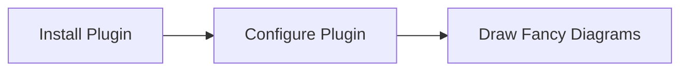

# Page 3

This is a test page to test out some markdown support and other plugins.


### Mermaid Support

`mermaid-svg`




`bob-svg`

```bob-svg
 o->  Basic shapes
                                                        .
       +------+   .------.    .------.      /\        .' `.
       |      |   |      |   (        )    /  \     .'     `.
       +------+   '------'    '------'    '----'     `.   .'
         _______            ________                   `.'   ^ /
        /       \      /\   \       \      ---->    | ^     / /
       /         \    /  \   )       )     <----    | |    / v
       \         /    \  /  /_______/               v |
        \_______/      \/
```
