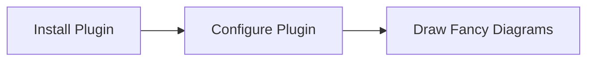
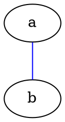

# Page 5

This is a test page to test out some markdown support and other plugins.


### Mermaid Support

`mermaid-svg`




### Ascii Drawing Support

`bob-svg`

```bob-svg
*----->
```

```bob
*----->
```

```bob-svg
 o->  Basic shapes
                                                        .
       +------+   .------.    .------.      /\        .' `.
       |      |   |      |   (        )    /  \     .'     `.
       +------+   '------'    '------'    '----'     `.   .'
         _______            ________                   `.'   ^ /
        /       \      /\   \       \      ---->    | ^     / /
       /         \    /  \   )       )     <----    | |    / v
       \         /    \  /  /_______/               v |
        \_______/      \/

        .-----------.       .   <.      .>  .          ^  \
       (             )     (      )    (     )          \  \
        '-----+ ,---'       `>   '      `  <'            \  v
              |/


 o->  Quick logo scribbles
        .---.                      _
       /-o-/--       .--.         |-|               .--.
    .-/ / /->       /--. \     .--)-|    .--.-.    //.-.\
   ( *  \/         / O  )|     |  |-|    |->| |   (+(-*-))
    '-.  \        /\ |-//      .  * |    '--'-'    \\'-'/
       \ /        \ '+'/        \__/                '--'
        '          '--'

```

```bob
 o->  Basic shapes
                                                        .
       +------+   .------.    .------.      /\        .' `.
       |      |   |      |   (        )    /  \     .'     `.
       +------+   '------'    '------'    '----'     `.   .'
         _______            ________                   `.'   ^ /
        /       \      /\   \       \      ---->    | ^     / /
       /         \    /  \   )       )     <----    | |    / v
       \         /    \  /  /_______/               v |
        \_______/      \/

        .-----------.       .   <.      .>  .          ^  \
       (             )     (      )    (     )          \  \
        '-----+ ,---'       `>   '      `  <'            \  v
              |/


 o->  Quick logo scribbles
        .---.                      _
       /-o-/--       .--.         |-|               .--.
    .-/ / /->       /--. \     .--)-|    .--.-.    //.-.\
   ( *  \/         / O  )|     |  |-|    |->| |   (+(-*-))
    '-.  \        /\ |-//      .  * |    '--'-'    \\'-'/
       \ /        \ '+'/        \__/                '--'
        '          '--'

```

### Graphviz Dot Support

`dot-svg`




# H1
This is an example of an h1

## H2
This is an example of an h2

### H3
This is an example of an h3

#### H4
This is an example of an h4

##### H5
This is an example of an h5

###### H6
This is an example of an h6

###### Code Example

```json
{
  "foo": "potato",
  "bar": "potato"
}
```

###### Table Example

Name | Type | Description
---|:---:|---
Foo | Any | Allows Foo. The foo name MUST be bar. The value can be `null`.
Foo | Any | Allows Foo. The foo name MUST be bar. The value can be `null`.
Foo | Any | Allows Foo. The foo name MUST be bar. The value can be `null`.
Foo | Any | Allows Foo. The foo name MUST be bar. The value can be `null`.
Foo | Any | Allows Foo. The foo name MUST be bar. The value can be `null`.

###### Emoji example

:+1: :dog:
